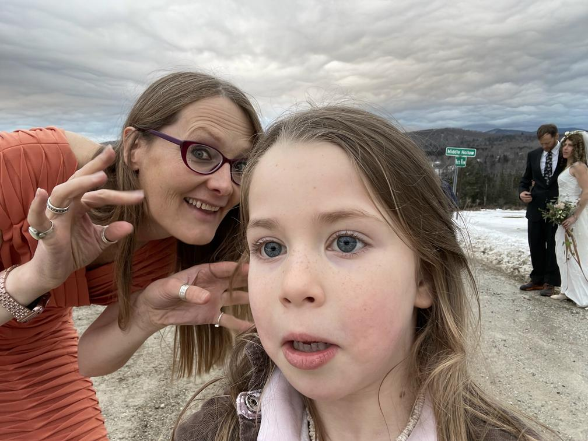

# jpg241
Author & serve a single progressive JPEG image which can be served as two different qualities
-- "Two for One" 😁

## Motivation
Tracey Jaquith, from [Internet Archive](https://archive.org), runs their Imagery API.  She was looking for a way to encode two downloadable qualities into a _single file_...

## Overview
We transform images to a 'steep progressive' JPEG.

Let's say we are sending out 180px width thumbnails.

This technique encodes a JPEG so the first ~6700 bytes (on average) have a
'displayed at 180px wide' _reasonable_ looking image for most cases.
Total filesize expected to be ~72kb file on average.

This means the low quality portion of the image, only ~10% on average of the full image file,
can be used for low-bandwidth situations where a user wants less bandwidth used.

Thus, you can encode a _single file_, and simply serve it two different ways.

For the preview image, you can just serve out the start of the file, cutting it off at the 3rd instance of hex pair of bytes `FFDA` 😁

(This will truncate the file after only sending out the first 2 "scans")

## Demo Site

[https://jpg241.dev.archive.org](https://jpg241.dev.archive.org)

| wedding.jpg   |  bytes   |  url |
| ------------- | -------: | --------------------------------------------------- |
| preview image |   10,165 | [wedding.jpg/preview](https://jpg241.dev.archive.org/img/wedding.jpg/preview) |
| full image    |  111,231 | [wedding.jpg](https://jpg241.dev.archive.org/img/wedding.jpg) |


### preview image

### full image



## Source Code
[https://github.com/internetarchive/jpg241](https://github.com/internetarchive/jpg241)


## Encoding imagery
We use this scans profile to get the lower-quality image into the first ~10% of the total image:
- [scans.txt](scans.txt)

Example encoding:
```sh
# convert to input for `cjpeg` -- you can add args like: `--resize 180x` or `--resize 25%`
convert INPUT INPUT.ppm

# create JPG with wanted scans profile
cjpeg -scans scans.txt INPUT.ppm > encoded.jpg
```
(see the [Dockerfile](Dockerfile) for more info on the packages for `convert` and `cjpeg`)

## More details

The encoded JPEG file will rely _primarily_ on the first and last of 6 scans for the main imagery data.

If we are sending the full file, but cutoff at the start of the 3rd scan (keeping first two),
that's averaging about 6700 bytes (of ~72kb full file) in testing a few hundred random items.
We keep one more scan than we think we might need because:
 - scans [2..5] are small (deliberately)
 - [https://archive.org/details/morebooks](https://archive.org/details/morebooks) was missing last few pixel rows w/ _just_ the 1st scan.

Clients / browsers / OS can handle the truncated image and will simply 'paint what it can'.

Progressive JPEG -
[https://cloudinary.com/blog/progressive_jpegs_and_green_martians](https://cloudinary.com/blog/progressive_jpegs_and_green_martians)
